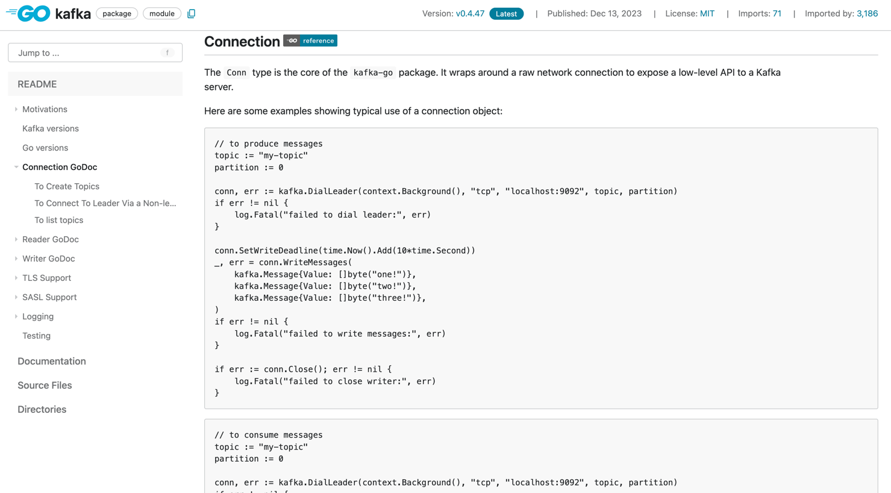
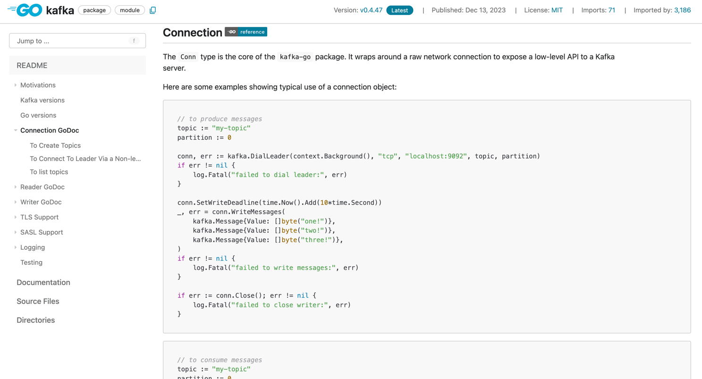

## About
I have never been able to read a package's documentation on pkg.go.dev since all the code there is in black & white...

This is the reason I created this repository to make it possible to read.

## Usage
Every time you want to read a package's documentation, you just need to replace [pkg.go.dev](https://pkg.go.dev) with [pkgo.dev](https://pkgo.dev). _(remove the `.g`)_.

## How it works
We use Nginx as proxy server.

Every time a request come in, we forward it to the [pkg.go.dev](https://pkg.go.dev) server, then append the [highlight.js](https://highlightjs.org) script to the response before sending it back to the client.

Since some README files do not specify the code language, we also update `<code>` tags to `<code class="language-go">` to enable syntax highlighting.

If you don't trust me, no worry, you can deploy it yourself:
- Append `127.0.0.1       pkg.go.dev.local` to `/etc/hosts`
- Run `docker-compose up -d --build`
- Access `http://pkg.go.dev.local`